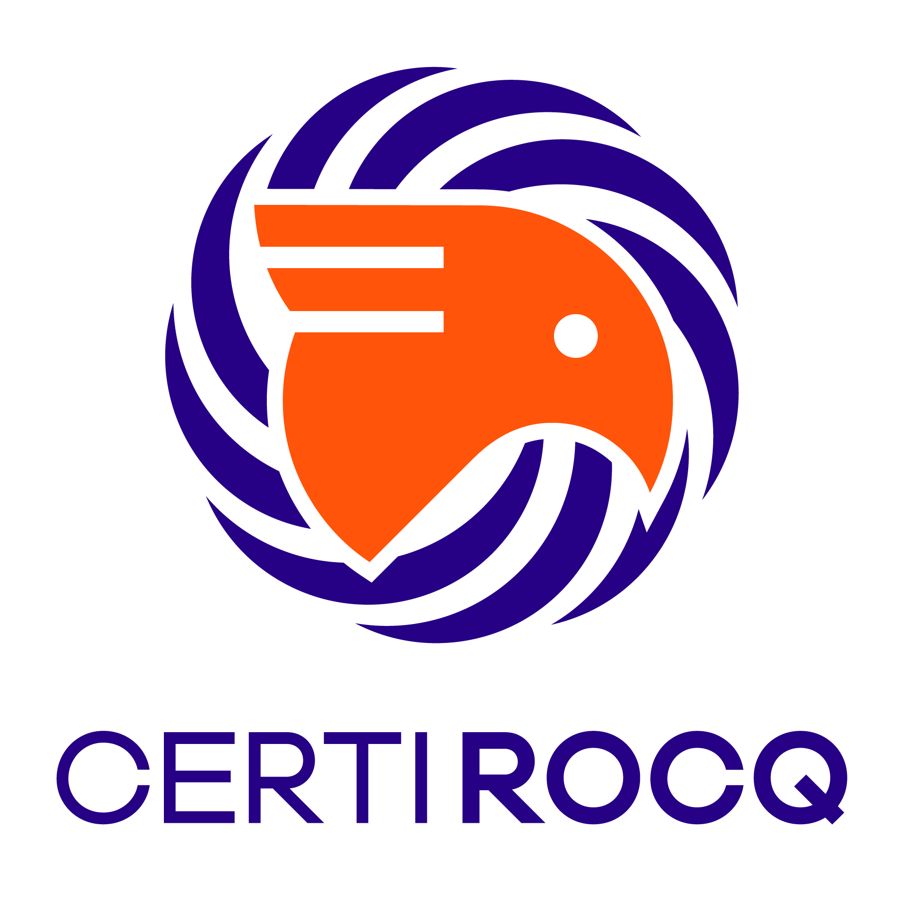

## Overview

CertiRocq (formerly CertiCoq) is a compiler for Gallina, the specification language of the [Rocq Prover](https://rocq-prover.org). CertiRocq targets WebAssembly and Clight, a subset of the C language that can be compiled with any C compiler, including the [CompCert](http://compcert.org) verified compiler.

The goal of the CertiRocq project is to build an end-to-end verified compiler for Gallina, bridging the gap between formally verified source programs and their compiled executables.  

Large parts of the CertiRocq compiler have been verified whereas others are in the process of being verified.

You can find CertiRocq's source code on [GitHub](https://github.com/CertiRocq/certirocq). See [INSTALL.md](https://github.com/CertiRocq/certirocq/blob/main/INSTALL.md) for installation instructions. CertiRocq is part of the [DeepSpec](https://deepspec.org) project.

## Current Members

[Andrew Appel](https://www.cs.princeton.edu/~appel/), [Yannick Forster](https://www.ps.uni-saarland.de/~forster/), [Joomy Korkut](https://joomy.korkutblech.com/), [Zoe Paraskevopoulou](https://zoep.github.io), [Kathrin Stark](https://www.k-stark.de/), and [Matthieu Sozeau](https://www.irif.fr/~sozeau/).

## Past Members and Contributors

Abhishek Anand, Anvay Grover, John Li, Greg Morrisett, Randy Pollack, Olivier Savary Belanger, Matthew Weaver

## Documentation

The [CertiRocq Wiki](https://github.com/CertiRocq/certirocq/wiki) has instructions for using the [CertiRocq plugin](https://github.com/CertiRocq/certirocq/wiki/The-CertiRocq-plugin) to compile Gallina to C and interfacing with the generated C code.

The Wiki also gives an [overview](https://github.com/CertiRocq/certirocq/wiki/The-CertiRocq-pipeline) of the compiler and its verification status.

You can also find end-to-end examples in [tests/programs/tests.v](https://github.com/CertiRocq/certirocq/blob/main/tests/programs/tests.v) and [tests/axioms/tests.v](https://github.com/CertiRocq/certirocq/blob/main/tests/axioms/tests.v).

## Publications 

- *[Machine-Generated, Machine-Checked Proofs for a Verified Compiler (Experience Report)](https://dl.acm.org/doi/10.1145/3828700)*, by Zoe Paraskevopoulou. Proc. ACM Program. Lang. Vol. 10, No. ICFP, Article 302 (20 pages), August 2026.

- *[A Verified Foreign Function Interface between Coq and C](https://doi.org/10.1145/3704860)*, by Joomy Korkut, Kathrin Stark, and Andrew W. Appel. Proc. ACM Program. Lang. 9, POPL, Article 24 (31 pages), January 2025.

- *[Compiling with Continuations, Correctly](https://doi.org/10.1145/3485491)*, by Zoe Paraskevopoulou and Anvay Grover, Proc. ACM Program. Lang. Vol. 5, No. OOPSLA, Article 114 (29 pages), October 2021.

- *[Compositional Optimizations for CertiCoq](https://doi.org/10.1145/3473591)*, by Zoe Paraskevopoulou, John M. Li, and Andrew W. Appel, Proc. ACM Program. Lang. Vol. 5, No. ICFP, Article 86 (30 pages), August 2021.

- *[Deriving Efficient Program Transformations from Rewrite Rules](https://doi.org/10.1145/3473579)*, by John M. Li and Andrew W. Appel, Proc. ACM Program. Lang. Vol. 5, No. ICFP, Article 74 (29 pages), August 2021.

- *[Coq Coq Correct! Verification of Type Checking and Erasure for Coq, in Coq](https://metacoq.github.io/coqcoqcorrect)*, by Matthieu Sozeau, Simon Boulier, Yannick Forster, Nicolas Tabareau and Théo Winterhalter. Proc. ACM Program. Lang. Vol. 4, No. POPL, Article 8 (28 pages), August 2021.

- *[Certified Code Generation from CPS to C](https://www.cs.princeton.edu/~appel/papers/CPStoC.pdf)*, by Olivier Savary Belanger, Matthew Z. Weaver, and Andrew W. Appel, October 2019.

- *Certifying Graph-Manipulating C Programs via Localizations within Data Structures*. Shengyi Wang, Qinxiang Cao, Anshuman Mohan, and Aquinas Hobor. OOPSLA: Conference on Object-Oriented Programming Systems, Languages, and Applications (OOPSLA 2019), Athens, Greece, October 2019.

- *Closure Conversion is Safe for Space*. Zoe Paraskevopoulou and Andrew W. Appel. Proceedings of the ACM on Programming Languages, vol. 3, no. ICFP, article 83, 29 pages, doi 10.1145/3341687, August 2019.

- *Shrink Fast Correctly!*. Olivier Savary Belanger and Andrew W. Appel. Proceedings of International Symposium on Principles and Practice of Declarative Programming (PPDP'17), pages 49-60, ACM Press, October 2017 (PPDP’17).

- *CertiCoq: A verified compiler for Coq*. Abhishek Anand, Andrew Appel, Greg Morrisett, Zoe Paraskevopoulou, Randy Pollack, Olivier Savary Belanger, Matthieu Sozeau, and Matthew Weaver. In CoqPL'17: The Third International Workshop on Coq for Programming Languages, January 2017.

## Funding

The project has been supported by the National Science Foundation, grants CCF-1407790,  CCF-1407794,  CCF-2005545, and the CIFellows program.

## License 

CertiRocq is open source and distributed under the [MIT license](https://github.com/CertiRocq/certirocq/blob/main/LICENSE.md).

## Bugs 

We use GitHub's [issue tracker](https://github.com/CertiRocq/certirocq/issues) to keep track of bugs and feature requests.
